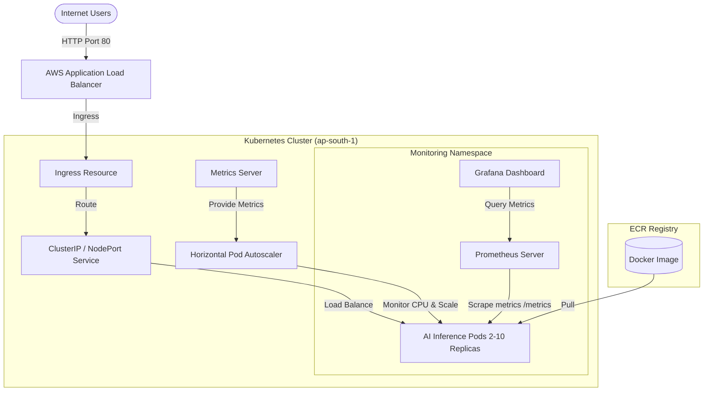

# AI Inference Application on AWS EKS using Terraform and Kubernetes

This project implements a production-ready, scalable machine learning inference platform on Amazon EKS (Elastic Kubernetes Service) provisioned using Terraform. It deploys a FastAPI Scikit-Learn service, configures autoscaling (HPA), provisions external traffic routing via the AWS Load Balancer Controller (ALB), and sets up monitoring via Prometheus and Grafana.

---

## Architecture Diagram



---

## Project Structure

```text
ai-inference-on-eks/
├── terraform/                   # Infrastructure as Code
│   ├── networking/              # VPC, Subnets, Gateways, Routes
│   ├── iam/                     # IAM Roles for EKS Control Plane, Nodes, and ALB Controller
│   ├── ecr/                     # AWS Elastic Container Registry
│   ├── eks/                     # EKS Cluster, Managed Node Group, OIDC Config
│   ├── providers.tf             # AWS, Kubernetes, Helm providers configuration
│   ├── variables.tf             # Global Terraform variables
│   ├── main.tf                  # Root orchestrator and Helm integrations
│   └── outputs.tf               # Terraform output definitions
├── app/                         # Machine Learning API Application
│   ├── train.py                 # Scikit-Learn model training script
│   ├── app.py                   # FastAPI app with Prometheus instrumentation
│   ├── requirements.txt         # Python application dependencies
│   └── Dockerfile               # Multi-stage optimized Docker build
├── kubernetes/                  # Kubernetes deployment manifests
│   ├── namespace.yaml           # Namespace ai-app
│   ├── deployment.yaml          # Replicas, limits, probes, and image metadata
│   ├── service.yaml             # External exposing rules
│   ├── ingress.yaml             # ALB Load Balancer configuration
│   └── hpa.yaml                 # Autoscaling policy (>70% CPU)
├── .github/
│   └── workflows/
│       └── deploy.yml           # GitHub Actions automated CI/CD pipeline
└── README.md                    # Project documentation
```

---

## Prerequisites

Ensure you have the following installed and configured locally:
- [AWS CLI](https://aws.amazon.com/cli/) (configured with administrator access in `ap-south-1`)
- [Terraform](https://www.terraform.io/) (>= 1.5.0)
- [kubectl](https://kubernetes.io/docs/tasks/tools/)
- [Docker Desktop](https://www.docker.com/products/docker-desktop/)

---

## Step 1: Provision Infrastructure with Terraform

Initialize and apply the Terraform configuration. This will spin up the VPC, subnets, NAT Gateway, EKS Cluster, Managed Node Groups, an ECR Registry, and install the Metrics Server, Prometheus/Grafana Stack, and AWS Load Balancer Controller.

```bash
cd terraform
terraform init
terraform validate
terraform plan
terraform apply -auto-approve
```

After the run finishes, take note of the outputs:
*   `cluster_name`
*   `ecr_repository_url`
*   `cluster_endpoint`

---

## Step 2: Build & Test the Docker Image Locally

The Dockerfile is structured to run the model training step (`train.py`) automatically inside the container during build to output `model.pkl`. This eliminates the need to install Scikit-Learn locally on your host machine.

1.  **Build the Docker Image**:
    ```bash
    cd ../app
    docker build -t ai-inference-app .
    ```

2.  **Run the Container Locally**:
    ```bash
    docker run -d -p 8000:8000 --name ai-app-container ai-inference-app
    ```

3.  **Test the Local Endpoint**:
    ```bash
    curl -X POST http://localhost:8000/predict \
      -H "Content-Type: application/json" \
      -d '{"feature1": 10, "feature2": 20}'
    ```
    Expected Response:
    ```json
    {"prediction": "approved"}
    ```

4.  **Stop and Clean Up Local Container**:
    ```bash
    docker stop ai-app-container
    docker rm ai-app-container
    ```

---

## Step 3: Push the Docker Image to ECR

Configure your local Docker daemon to authenticate with AWS ECR, tag your image, and push it.

```bash
# Retrieve ECR Repository URL from Terraform outputs (e.g., <ACCOUNT_ID>.dkr.ecr.ap-south-1.amazonaws.com)
aws ecr get-login-password --region ap-south-1 | docker login --username AWS --password-stdin <AWS_ACCOUNT_ID>.dkr.ecr.ap-south-1.amazonaws.com

# Tag and push the local image
docker tag ai-inference-app:latest <AWS_ACCOUNT_ID>.dkr.ecr.ap-south-1.amazonaws.com/ai-inference-app:latest
docker push <AWS_ACCOUNT_ID>.dkr.ecr.ap-south-1.amazonaws.com/ai-inference-app:latest
```

---

## Step 4: Configure kubectl & Deploy to EKS

1.  **Update Kubeconfig for EKS**:
    ```bash
    aws eks update-kubeconfig --region ap-south-1 --name ai-platform-eks
    ```

2.  **Update the Image Reference**:
    Open [kubernetes/deployment.yaml](file:///kubernetes/deployment.yaml) and replace the placeholder `<AWS_ACCOUNT_ID>` with your AWS Account ID:
    ```yaml
    image: <AWS_ACCOUNT_ID>.dkr.ecr.ap-south-1.amazonaws.com/ai-inference-app:latest
    ```

3.  **Deploy Manifests**:
    Apply all manifests in the `kubernetes` folder:
    ```bash
    cd ../kubernetes
    kubectl apply -f .
    ```

---

## Step 5: Verify Deployments

1.  **Check Pod Status**:
    ```bash
    kubectl get pods -n ai-app
    ```

2.  **Verify Services and Load Balancers**:
    ```bash
    kubectl get svc -n ai-app
    kubectl get ingress -n ai-app
    ```
    *Wait 2–3 minutes for AWS to configure the Application Load Balancer.* Copy the `ADDRESS` of the ingress (e.g., `k8s-aiapp-aiinferen-xxxx.ap-south-1.elb.amazonaws.com`).

3.  **Test Inference on EKS**:
    ```bash
    curl -X POST http://<ALB_DNS_NAME>/predict \
      -H "Content-Type: application/json" \
      -d '{"feature1": 10.0, "feature2": 20.0}'
    ```

---

## Step 6: Monitoring (Prometheus & Grafana)

The FastAPI application has a built-in Prometheus instrumentator that exposes system metrics on the `/metrics` endpoint.

1.  **Port-Forward to Grafana**:
    Locate the Grafana service running inside the `monitoring` namespace:
    ```bash
    kubectl get svc -n monitoring
    ```
    Forward traffic from local port `3000` to the Grafana service:
    ```bash
    kubectl port-forward svc/prometheus-community-grafana -n monitoring 3000:80
    ```

2.  **Access Grafana**:
    - Open `http://localhost:3000` in your web browser.
    - **Username**: `admin`
    - **Password**: `admin123` (configured in `main.tf`)
    
3.  **Explore Metrics**:
    You can query application metrics like `http_requests_total` or view pre-installed Kubernetes dashboards (such as CPU, Memory, and Network usage per container).

---

## Step 7: GitHub Actions CI/CD Setup

To enable the automated deployment pipeline:
1. Fork/push this repository to your GitHub repository: `https://github.com/bittush8789/terraform-ai-inference-platform.git`
2. In your GitHub repository settings, navigate to **Settings > Secrets and variables > Actions**.
3. Create the following repository secrets:
   - `AWS_ACCESS_KEY_ID`: Your AWS access key.
   - `AWS_SECRET_ACCESS_KEY`: Your AWS secret access key.
   
Whenever you commit and push to the `main` branch, the pipeline will build the new image, push it to ECR, deploy it to EKS, and run a rolling update checks.

---

## Bonus Challenge: GPU Nodes & Hugging Face LLM Deployments

To transition this setup from Scikit-Learn to a GPU-accelerated LLM pipeline (e.g., Hugging Face or Llama using vLLM):

### 1. Provision GPU Nodes in Terraform
Add a GPU-specific node group to `terraform/eks/main.tf` using instances equipped with NVIDIA GPUs (such as the `g4dn` series) and configure the EKS GPU AMI type:

```hcl
resource "aws_eks_node_group" "gpu" {
  cluster_name    = aws_eks_cluster.main.name
  node_group_name = "gpu-node-group"
  node_role_arn   = var.node_role_arn
  subnet_ids      = var.private_subnet_ids

  scaling_config {
    desired_size = 1
    max_size     = 2
    min_size     = 0
  }

  instance_types = ["g4dn.xlarge"]  # NVIDIA T4 Tensor Core GPU, 16GB VRAM
  ami_type       = "AL2_x86_64_GPU" # EKS optimized GPU AMI

  labels = {
    "hardware-type" = "gpu"
  }
}
```

### 2. Deploy the NVIDIA Device Plugin
To make GPUs schedulable inside Kubernetes, you must install the NVIDIA Device Plugin. Run:
```bash
kubectl apply -f https://raw.githubusercontent.com/NVIDIA/k8s-device-plugin/v0.14.0/nvidia-device-plugin.yml
```

### 3. Deploy a Hugging Face model using vLLM
Replace the Scikit-Learn FastAPI Docker image with a vLLM server to serve models like `meta-llama/Llama-3-8B-Instruct`. Below is an example Kubernetes deployment that schedules on GPU nodes and allocates GPU resources:

```yaml
apiVersion: apps/v1
kind: Deployment
metadata:
  name: vllm-llama-deployment
  namespace: ai-app
spec:
  replicas: 1
  selector:
    matchLabels:
      app: vllm-llama
  template:
    metadata:
      labels:
        app: vllm-llama
    spec:
      containers:
        - name: vllm-container
          image: vllm/vllm-openai:latest
          args: [
            "--model", "facebook/opt-125m",  # Change to llama or other Hugging Face models
            "--port", "8000"
          ]
          env:
            - name: HUGGING_FACE_HUB_TOKEN
              valueFrom:
                secretKeyRef:
                  name: hf-token-secret
                  key: token
          ports:
            - containerPort: 8000
          resources:
            limits:
              nvidia.com/gpu: "1"  # Instructs Kubernetes to allocate 1 GPU
            requests:
              cpu: "2"
              memory: "8Gi"
      nodeSelector:
        hardware-type: gpu         # Ensure scheduling only on the GPU node group
```

---

## Clean Up Resources

To avoid incurring AWS charges, destroy the resources after testing:

```bash
kubectl delete -f kubernetes/
cd terraform
terraform destroy -auto-approve
```
